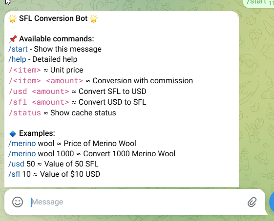

# SFL Conversion Bot 🤖

## RUN RENDER
https://github.com/josevdr95new/SFLConversionBot/tree/run_render

Telegram bot for converting in-game items and currencies (SFL/USD) with real-time rates.

## Requirements 📋
- Python 3.7+
- Telegram bot token ([Get from @BotFather](https://t.me/BotFather))

## Quick Start 🚀

1. Clone repo and install dependencies:
```bash
git clone https://github.com/josevdr95new/SFLConversionBot.git
cd SFLConversionBot
pip install -r requirements.txt
```

2. Create a `.env` file in the root directory and add your Telegram bot token:
```
BOT_TOKEN=your_bot_token_from_BotFather
```

3. Start the bot:
```bash
python -m sfl_bot.main
```

## Getting a Telegram Bot Token 🔑

1. Open Telegram and search for [@BotFather](https://t.me/BotFather)
2. Start a chat with BotFather and send `/newbot` command
3. Follow the instructions to name your bot and create a username
4. BotFather will provide a token - save this for your `.env` file
5. Configure additional bot settings like description and commands using BotFather

### Bot Commands Preview


## Health Monitoring 🩺

The bot includes a health check endpoint to monitor its status and performance.

**How to use the `/ping` endpoint:**

1. Ensure the bot is running
2. Make a GET request to the `/ping` endpoint using either:
   - Web browser: `http://localhost:8000/ping`
   - Command line:
     ```bash
     curl http://localhost:8000/ping
     ```

## Contributing 🤝

Contributions welcome! Please feel free to submit a Pull Request.
